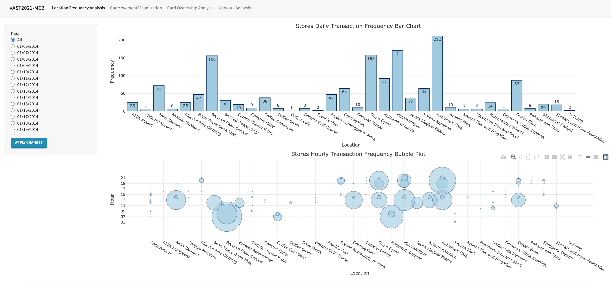
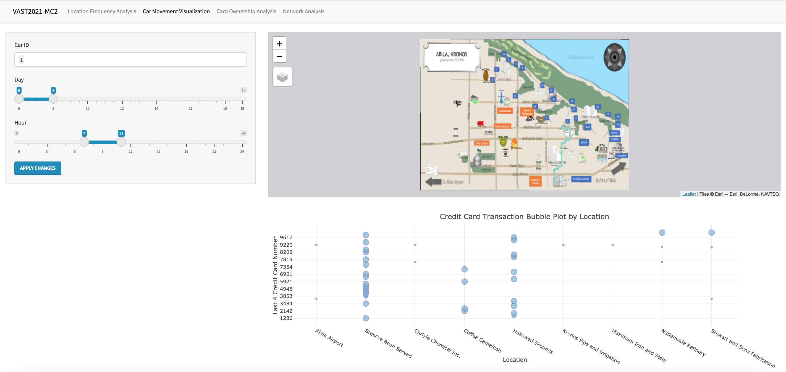
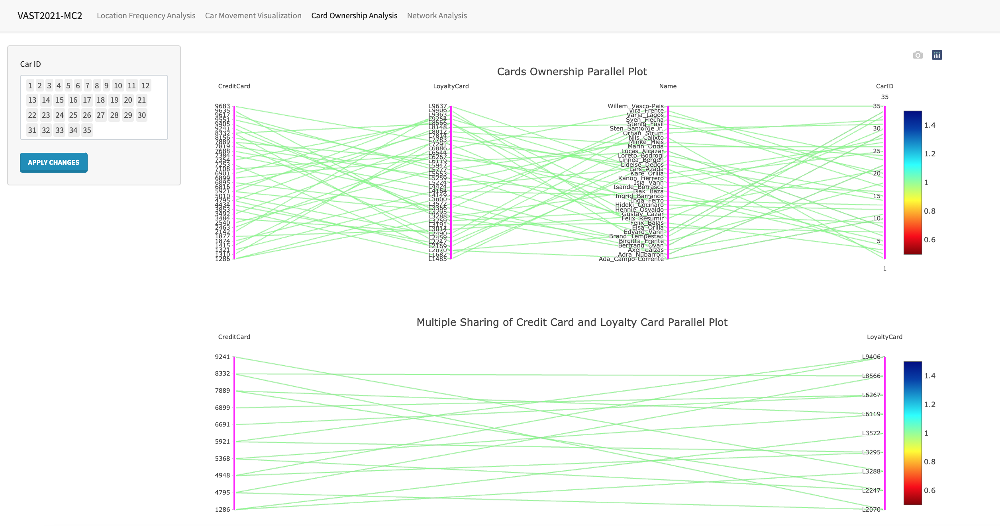
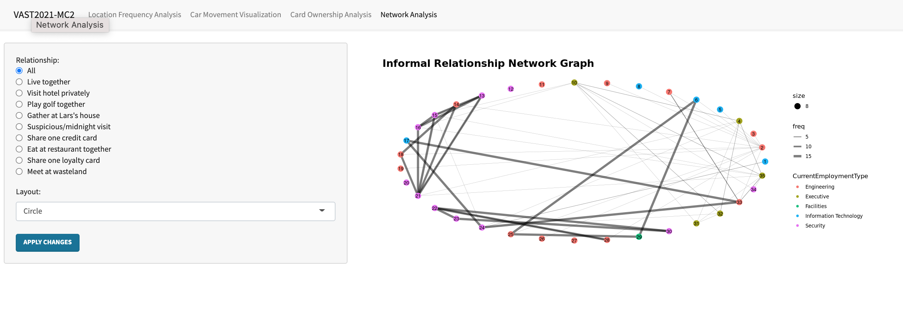

```{r setup, include=FALSE}
knitr::opts_chunk$set(echo = FALSE)

# Learn more about creating blogs with Distill at:
# https://rstudio.github.io/distill/blog.html

```

[Please click here to explore our Shiny Application!](https://miaolu3345.shinyapps.io/shiny/)

> Location Frequency analysis page overview



> Car movement analysis page overview



> Car ownership analysis page overview



> Network page overview

