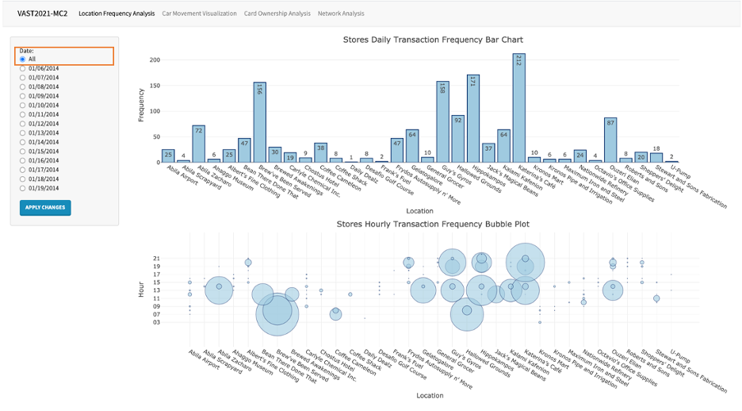
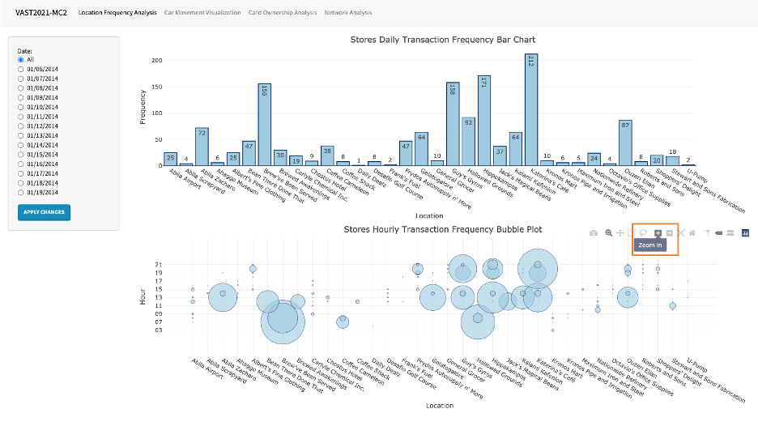
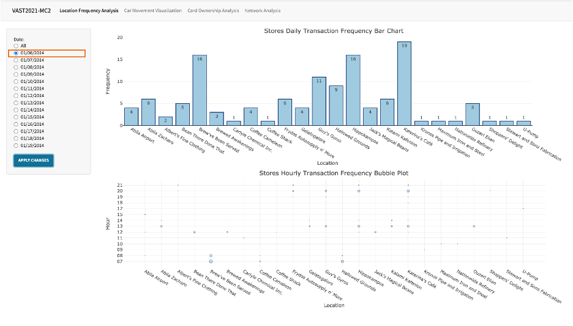
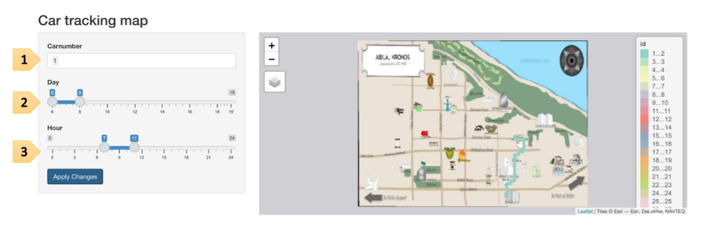
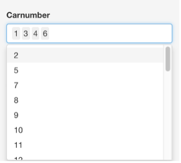
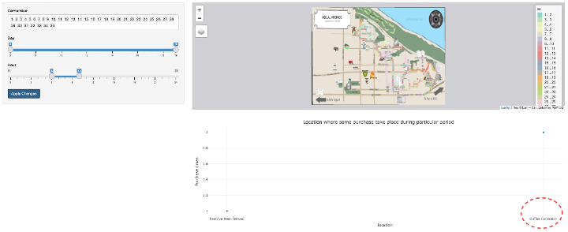
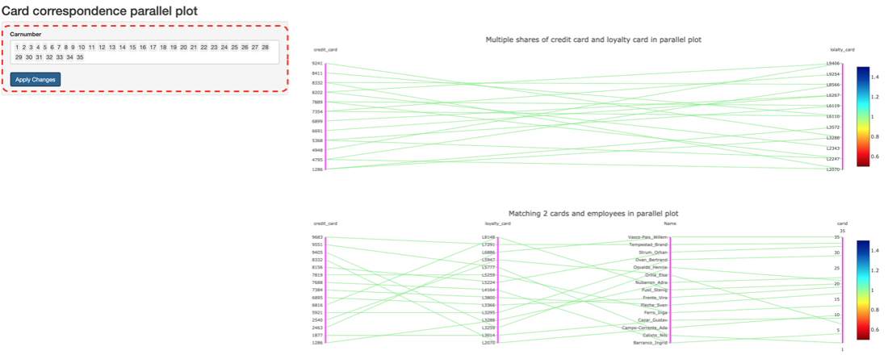
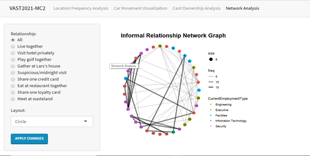
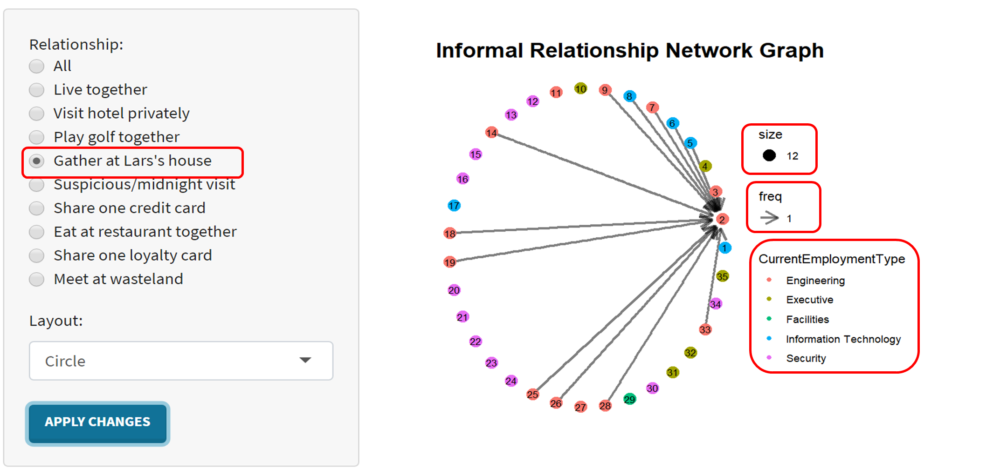

```{r setup, include=FALSE}
knitr::opts_chunk$set(echo = TRUE)
```

# 1. Location Popularity dashboard

In this page, users can use the daily frequency bar chart to observe the frequency of each store in selected period and use the hourly frequency bubbly plot to view the time distribution of their daily frequency, in which the size of bubble represents the frequency. And this dashboard is also used to answer MC2-Q1: Identify the most popular locations, and when they are popular.

[1.1] Select “All” in Date sidebar to view the overall location popularity and the overall hourly distribution among these two weeks.



[1.2] The PLOTLY package we used allows users to select certain area on the chart and zoom into it to have a clearer view of certain stores.



[2] Select certain date like “01/06/2014” in Date sidebar to view the location popularity and its hourly distribution in specific day.



# 2. Car tracking map

In this page, the background is the map of Abila, we aim to tracking the path of each car over past 14 days.


[1] Select the desired car id to look at the path, multiple car number can be picked at one time.



[2] Select the day of the date from 2014-01-06 to 2014-01-14. For example, if we select 6-8, this means that the date range is from 2014-01-06 to 2014-01-08. Note that the day controller can apply to 2 graphs at the same time in the page.




[3] Select the time interval in one day, this slider bar can be combined with last one to tracking the path in specific day at specific time. Note that the hour controller can apply to 2 graphs same as the day controller in the page.

# 3.	Parallel chart

In this page, there are two parallel graphs shown, the first graph aims to show the correspondence between the credit cards and loyalty cards which have the cross-used happening. The second one aims to show the matching relationship including cards information and employee information. One thing worth mentioning is that the car controller only can apply to the second graph.


[1] Select the desired car id to look at the explicit relationships between two cards, employee name as well as car id, multiple car numbers can be picked at one time. Since the first graph has no carid information so the controller can apply to the second graph.
[2] The legend on the right page is to show the number of relations happening in the data, however this is meaningless in a sense in the graph since we have already removed the duplicate data.

# 4.	Network

In this page, users can check all informal relationships we recognized.



[1] Select which kind of relationship they want to check on the radio button from left side, default is all.  

[2] Select which kind of layout you want to use, default is Circle. Click “Apply Changes”.  

[3] On the middle part is the network graph. Each node is an employee of GAStech, the number of each node is the car ID of each employee assigned.  The edge implies the relationship between two employees. Edges for “Party at Lars’s house’ and ‘Suspicious/midnight visit” are directed, the rest are undirected. The arrows are pointed from visitors to employees who are visited.

[4] On the right side is the legend of network. Size implies the size of each node. Freq implies how many times activities happened. The larger the freq is, the closer the relationship is. CurrentEmploymentType implies the department each color of the node.

