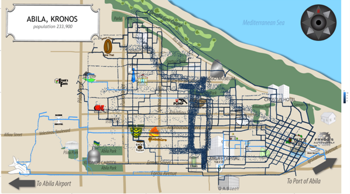
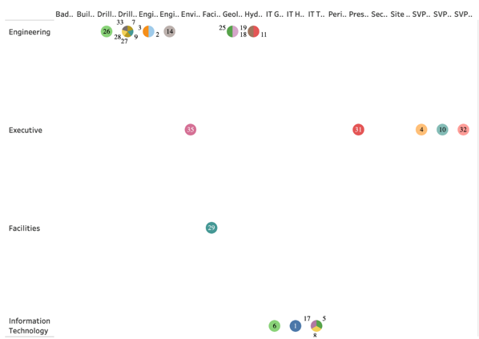
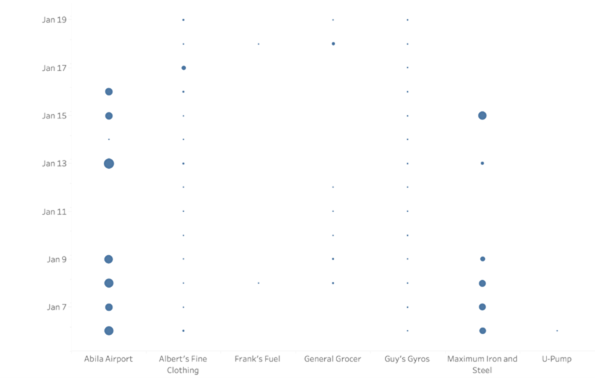
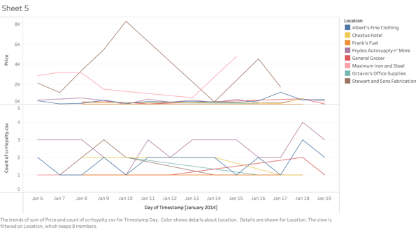
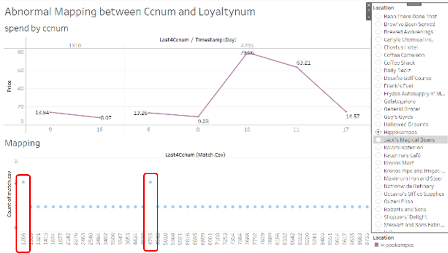
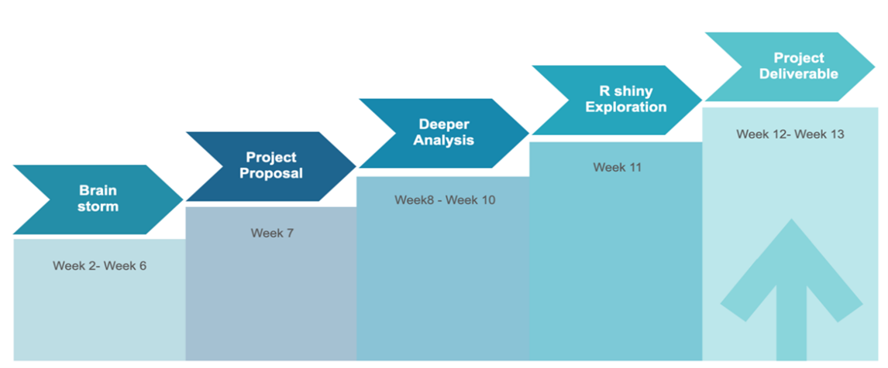

```{r setup, include=FALSE}
knitr::opts_chunk$set(echo = FALSE)

# Learn more about creating blogs with Distill at:
# https://rstudio.github.io/distill/blog.html

```

# 1. Motivation
In January 2014, several employees of GAStech went missing while leaders of GAStech are celebrating for company’s initial public offering. Because GAStech has not been good at environment management while producing natural gas, an organization is suspected of this disappearance. To find out the truth of this case, we should analyze GAStech’s employees’ activities to find out any suspicious clue and crime suspect.

To achieve this, our group used visualization techniques: maps, pie charts, line graphs and interactions to provide insights of employees’ shopping habit, relationship network and abnormal behaviors relating to disappearance.      

# 2. Problem& Issue
In the kidnapping case of GAStech company employees in Kronos, we aim to find the abnormal facts that may be related to this case by data visualization. In detail, our group plan to conduct an in-depth investigation through Mini-challenge2 by analyzing their credit card transactions, loyalty card usage and vehicle tracking data to address these issues below:

* Analyzing credit and loyalty card data, identify the most popular locations and most popular time to find out anomalies and carried out some measures to correct them.
* Visualize the vehicle tracking data to get the vehicle trajectory and analyze those abnormal routes.
* Map the vehicle data to the analysis of credit and loyalty card data to locate the discrepancies and ownership between them.
* Analyzing the life pattern among GASTech personnel to identify potential informal or unofficial relationships among them, adding in their email data in MC1 if necessary.
* Combined with the above analysis, dig out suspicious activities may be related to this kidnapping case and located suspicious locations kidnapping might happen.

# 3. Relevant work
Work Scope|Principal
----------|----------
Data cleansing and preparation 	|Zhang Xinru
Credit Card analysis by RFM model, Market Basket Analysis	|Zhang Xinru
Loyalty Card analysis |	Zhang Xinru
Mapping of Loyalty Card to Credit Card|	Zhong Ping
Social Analysis for GASTech personnel	|Zhong Ping
Geographic visualization of vehicle tracking	|Miao Lu
Ownership analysis of vehicle, credit card and loyalty card	|Miao Lu
Text analysis of staff email	|Miao Lu
Suspicious activities analysis 	|Zhong Ping
Application build	|All members

# 4.Approach & Methodology
## 4.1 Visualization
The possible visualization methods we are possibly using the graph shown below.

Plot|	Description
-----|------
Geospatial map|	To navigate how the pace change over time and the distribution of different car.
Pie chart	|To observe categorical distribution of employees, stores.
Scatter plot	|To show the size of sales.
Line plot|	To plot the sale changes over time.
Heatmap 	|To observe the relationship between 2 variables
## 4.2 Rstudio
R studio is the main tool that we are using to achieve the interaction. The packages that we may use include:

Package	|Description
--------|-----------
R shiny	|To create the interactive application
tidyverse	|Data processing and Data wrangling
leaflet	|To create interactive map
ggplot2	|To plot the graph
grid	|To add annotation
dplyr	|For data manipulation

# 5.	Storyboard

In order to draw conclusive relationships and results. We propose to develop some graph in Shiny R to visualize these relationships:

## 5.1 Geospatial map of cars driving

{width=100%}
Tab 1 aims to keep track of employees’ path over past 14 days. The features of map should include:</br> * Interactive (car ID, time)</br>  * Able to distinguish the place.  So far, we found some insights which may be useful in the future.</br> 1.ID15 and ID16 live the same place. And they went to a place at 3AM several times.</br>  2.	ID4 and ID10 went to the company earlier than others and they liked to have a breakfast together.

## 5.2 Pie chart of GAStech department

{width=90%}  
Tab 2 is the pie chart type of distribution, aiming to see the relationship of each employee in the working environment. This type of relationship can be combined with other graph to do some further analysis or make appropriate assumption.</br>For example, from the graph we can see that id 4 and id 10 is from executive department, so this observation may explain why they always go to the company earlier than others.

## 5.3 Scatter plot of each store

  
The scatter plot can be used to see if there are some abnormal purchases happened over last 14 days, the size of circle can represent the sales that day. And comparing to the size of circle each day we can find the normal sales and then get the abnormal one. In this graph, we also need to implement interaction in the future to observe specific store.

## 5.4 Line chart for sales and number of purchases

  
Line chart is a very useful graph to see the changes of sales over time. The first line chart is to show the sales changes in each store and the second one talks about the times of purchased each store occur. Combining 2 chart would be better to find out the abnormal purchase. The chart also needs to be interactive to select particular store which may be related to the suspects.

## 5.5 Abnormal Mapping between Ccnum and Loyaltynum


This dashboard combines a line chart and a density graph. The density graph showing two abnormal mapping between employee’s credit card and employee’s loyalty card, which means credit cards ending with “1310” and “4795” are sharing two loyalty cards. The line graph shows transaction history of the two suspicious credit/debit card to help further find out the relationship between owners of “1310” and “4785”.

# 6.	Project Timeline


